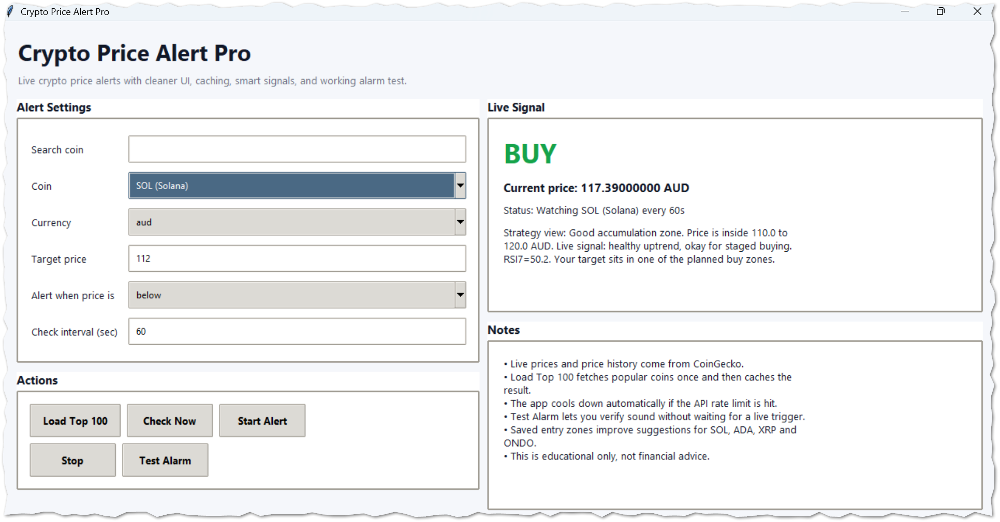

# Crypto Price Alert Pro


Crypto Price Alert Pro is a desktop application built with Python and Tkinter that tracks live cryptocurrency prices and notifies you when your custom price conditions are met.

It integrates with the CoinGecko API and provides simple strategy insights using technical indicators like RSI and moving averages.

---

## 📸 Screenshots



---

## 🚀 Features

- 📈 Live crypto price tracking (CoinGecko API)
- 🔔 Custom alerts (price above or below target)
- 🧠 Strategy signals (BUY / WATCH / WAIT)
- 📊 Basic indicators (RSI + moving averages)
- 🔍 Search and filter coins
- 🪙 Load Top 100 coins dynamically
- ⚡ Smart caching to reduce API calls
- 🛑 Built-in rate limit handling
- 🔊 Alarm notification + test button
- 💱 Supports USD and AUD

---

## 💡 Why I Built This

I built this project to monitor crypto prices without relying on multiple browser tabs or paid tools.  

It also helped me explore:
- API integration
- Caching strategies
- Threading in Python
- Building desktop GUIs with Tkinter

---

## 🏗️ Architecture

- **Tkinter** → GUI interface  
- **CoinGecko API** → Live price data  
- **Threading** → Background monitoring loop  
- **Caching layer** → Reduces API calls & handles rate limits  

---

## 🛠️ Installation

### 1. Clone the repository

```bash
git clone https://github.com/cseapel/crypto-price-alert-pro.git
cd crypto-price-alert-pro
